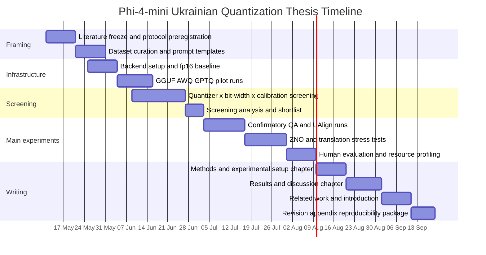

# Quantization and Multilingual LLMs for a Phi-4-mini Ukrainian Thesis

## Executive summary

The clearest conclusion from the 2024–2026 literature is that quantization does **not** degrade multilingual models uniformly across languages, tasks, or calibration setups. The strongest multilingual papers show three recurring patterns: English-only calibration is often a weak default for multilingual models; 4-bit quantization is usually the safest efficiency point, while 3-bit and especially 2-bit regimes expose much larger language-specific failures; and automatic metrics alone can miss degradation that becomes obvious in human judgement, especially on realistic prompts and harder reasoning tasks. citeturn28view2turn30view0turn29view0turn25view8

For your thesis, the most defensible experimental core is **Phi-4-mini-instruct** as the single model family, with a **full-precision baseline plus GGUF/GPTQ/AWQ quantized variants**, and a **controlled English–Ukrainian comparison built primarily around UA-SQuAD vs SQuAD 2.0**, because UA-SQuAD is explicitly derived from SQuAD and therefore gives the cleanest matched cross-language setup. Use **UAlign** as a second paired English–Ukrainian benchmark because it provides parallel EN–UK items and already documents an English–Ukrainian performance gap. Treat **ZNO-Eval** and MT benchmarks such as **FLORES/LongFlores/WMT24++** as external-validity stress tests rather than the main controlled comparison. citeturn13view3turn6view9turn14view5turn7view0turn8search0turn10search0

The strongest design choice suggested by the literature is to **separate the thesis into a confirmatory track and an exploratory track**. The confirmatory track should test whether Ukrainian degrades more than English under matched quantization conditions on paired QA/alignment data; the exploratory track should test whether this degradation becomes worse on reasoning and translation, and whether language-aware calibration, mixed calibration, or selective higher-precision tensors can mitigate it. That split will make the thesis both rigorous and manageable. citeturn30view0turn29view0turn34view0turn20view0

A second major conclusion is practical rather than theoretical: there is **little directly published, peer-reviewed evidence on quantized Phi-4-mini itself**, but the official model card describes Phi-4-mini-instruct as a 3.8B dense decoder-only model intended for multilingual, memory/compute-constrained use, `vLLM` lists it as supported, and an official PyTorch-hosted AWQ-INT4 checkpoint already exists. That means your thesis can make an original contribution by bringing multilingual/Ukrainian quantization evaluation to a model family that is clearly deployable locally, but not yet well studied in this exact setting. citeturn12view0turn12view3turn24view1turn24view0

## Literature map and citation priorities

The table below prioritises the papers most useful for your thesis design. I have focused on verified primary sources and included a small number of peripheral-but-useful method papers where they directly inform experimental design, mitigation, or reproducibility.

| Paper | Year | Direct multilingual quantization relevance | Key experimental takeaways | Citation priority |
|---|---:|---|---|---|
| urlHow Does Quantization Affect Multilingual LLMs?turn0search2 | 2024 | High | Human evaluation can reveal much larger losses than automatic metrics; non-Latin scripts and reasoning-heavy tasks are especially fragile. | Core |
| urlCalibrating Beyond English: Language Diversity for Better Quantized Multilingual LLMsturn30view0 | 2026 | High | English-only calibration is suboptimal; language-matched or multilingual calibration improves GPTQ/AWQ perplexity. | Core |
| urlThe Uneven Impact of Post-Training Quantization in Machine Translationturn29view0 | 2025 | High | 4-bit often survives for high-resource MT, but low-resource and typologically diverse languages degrade more; GGUF is most consistent. | Core |
| urlMultilingual Brain Surgeon: Large Language Models Can Be Compressed Leaving No Language behindturn34view0 | 2024 | High | Multilingual, training-distribution-aware calibration helps low-resource languages more than English-centric calibration. | Core |
| urlEnglish K_Quantization of LLMs Does Not Disproportionately Diminish Multilingual Performanceturn34view3 | 2025 | Medium | For GGUF importance matrices, English-only calibration did not significantly hurt Norwegian relative to English in one local-deployment setup; good negative/control result. | Supporting |
| urlOutliers and Calibration Sets have Diminishing Effect on Quantization of Modern LLMsturn25view2 | 2024 | Medium | Newer models are more robust to calibration content than older OPT-style baselines; older PTQ intuitions may not transfer. | Supporting |
| urlSelf-calibration for Language Model Quantization and Pruningturn25view1 | 2025 | Medium | Synthetic, model-generated calibration can be competitive and sometimes better than “real” calibration data. | Core |
| urlBeyond Fixed-Length Calibration for Post-Training Compression of LLMsturn25view0 | 2025 | Medium | Calibration sequence length matters; do not assume short fixed-length snippets are neutral. | Supporting |
| urlA Comprehensive Evaluation of Quantization Strategies for Large Language Modelsturn25view8 | 2024 | Medium | 4-bit is often close to full precision; evaluate knowledge, alignment, and efficiency together; perplexity is useful but not sufficient. | Supporting |
| urlLLMC: Benchmarking Large Language Model Quantization with a Versatile Compression Toolkitturn25view7 | 2024 | Medium | Benchmarking must vary calibration data, algorithms, and data formats systematically. | Supporting |
| urlRevisiting Pruning vs Quantization for Small Language Modelsturn25view9 | 2025 | Medium | In the 0.5B–3.8B regime, quantization reliably beats pruning on multilingual fidelity and reasoning. | Core |
| urlAn empirical study of LLaMA3 quantization: from LLMs to MLLMsturn25view6 | 2024 | Low | Ultra-low bits still hurt significantly; LoRA-style recovery is worth testing after quantization. | Supporting |
| urlAMQ: Enabling AutoML for Mixed-precision Weight-Only Quantization of Large Language Modelsturn25view3 | 2025 | Low | Layer-wise mixed precision is viable under strict memory budgets; useful for a mitigation chapter. | Supporting |
| urlMergeQuant: Accurate 4-bit Static Quantization of Large Language Models by Channel-wise Calibrationturn25view4 | 2025 | Low | Channel-wise static calibration can improve speed without sacrificing too much quality. | Peripheral |
| urlLLM-QAT: Data-Free Quantization Aware Training for Large Language Modelsturn25view5 | 2024 | Low | If 2-bit PTQ collapses, data-free QAT is the main literature-backed escalation path. | Peripheral |
| urlEvaluating Quantized Large Language Models for Code Generation on Low-Resource Language Benchmarksturn34view4 | 2024 | Low | On consumer hardware, 4-bit is usually the best quality/size compromise; 2-bit drops sharply. | Peripheral |
| urlOn the Limitations of Language Targeted Pruning: Investigating the Calibration Language Impact in Multilingual LLM Pruningturn34view1 | 2024 | Low | Target-language calibration can lower perplexity while still failing to improve downstream tasks. | Supporting |
| urlLanguage-Specific Pruning for Efficient Reduction of Large Language Modelsturn34view2 | 2024 | Low | Ukrainian-specific calibration matters in compression, even though the paper studies pruning rather than quantization. | Supporting |

The pattern across these papers is unusually coherent: **language-aware calibration helps**, **4-bit is the best default**, **2-bit is a risky edge case**, and **small-model/local-deployment studies matter disproportionately for your thesis because Phi-4-mini is 3.8B, not 70B**. The literature is therefore mature enough to support a strong thesis design, but still open enough that your Phi-4-mini-on-Ukrainian contribution would be genuinely additive. citeturn30view0turn29view0turn25view9turn25view8turn34view2

## Paper-by-paper insights for experimental design and mitigation

### Core quantization papers

**urlHow Does Quantization Affect Multilingual LLMs?turn0search2** — Kelly Marchisio, Saurabh Dash, Hongyu Chen, Dennis Aumiller, Ahmet Üstün, Sara Hooker, Sebastian Ruder. *Findings of the Association for Computational Linguistics: EMNLP 2024.* **Priority: Core.**  
This is the single most important paper for the thesis rationale. It shows that language-specific damage can be much larger in human evaluation than automatic metrics suggest, that non-Latin scripts are hit hardest, and that more difficult tasks such as mathematical reasoning degrade fastest; for your design, the direct lesson is to include at least one small blind human study and one “hard” task beyond extractive QA. citeturn28view2turn28view3turn28view4

**urlCalibrating Beyond English: Language Diversity for Better Quantized Multilingual LLMsturn30view0** — Everlyn Asiko Chimoto, Mostafa Elhoushi, Bruce Bassett. *EACL 2026 Long Papers.* **Priority: Core.**  
This paper is the strongest direct support for your calibration design. It evaluates eight calibration settings across GPTQ and AWQ on ten languages and shows that English-only calibration is consistently weaker than non-English or multilingual mixtures; the practical implication is that calibration composition must be treated as a first-class independent variable, not a hidden implementation detail. citeturn30view0

**urlThe Uneven Impact of Post-Training Quantization in Machine Translationturn29view0** — Benjamin Marie, Atsushi Fujita. *arXiv, 2025.* **Priority: Core.**  
This is the strongest translation-specific quantization result relevant to your Ukrainian work. Its design lesson is that MT should be analysed separately from QA/reasoning, because 4-bit may remain acceptable on high-resource settings while low-resource and typologically diverse languages collapse much more sharply, especially at 2-bit; it also suggests that GGUF deserves a serious place in your main comparison, not just as a deployment convenience. citeturn29view0

**urlMultilingual Brain Surgeon: Large Language Models Can Be Compressed Leaving No Language behindturn34view0** — Hongchuan Zeng, Hongshen Xu, Lu Chen, Kai Yu. *LREC-COLING 2024.* **Priority: Core.**  
This paper gives you a principled way to build multilingual calibration sets: sample calibration data proportionally to language distributions rather than defaulting to English. For the thesis, that translates into a useful mitigation experiment: compare English-only calibration against Ukrainian-only, EN+UK balanced, and a training-distribution-inspired multilingual mixture. citeturn34view0

**urlSelf-calibration for Language Model Quantization and Pruningturn25view1** — Miles Williams, George Chrysostomou, Nikolaos Aletras. *NAACL 2025 Long Papers.* **Priority: Core.**  
This paper is the best justification for a **synthetic/self-calibration** arm. It argues that calibration data are often unrepresentative and occasionally unavailable, then shows that model-generated synthetic calibration can be consistently competitive and often better than real data; in your thesis, this can become a mitigation condition when Ukrainian raw text is scarce or when you want to avoid dataset leakage. citeturn27view1turn27view3turn27view4

**urlRevisiting Pruning vs Quantization for Small Language Modelsturn25view9** — verified on ACL Anthology, *Findings of EMNLP 2025.* **Priority: Core.**  
Although this paper compares pruning and quantization, it is unusually relevant because it covers models up to **3.8B**, the same order of magnitude as Phi-4-mini-instruct. Its main thesis-level use is to justify why you should spend very little time on pruning baselines: in the small-model multilingual regime, quantization preserves fidelity, multilingual perplexity, and reasoning better. citeturn25view9

### Supporting quantization and calibration papers

**urlOutliers and Calibration Sets have Diminishing Effect on Quantization of Modern LLMsturn25view2** — Davide Paglieri, Saurabh Dash, Tim Rocktäschel, Jack Parker-Holder. *arXiv, 2024.* **Priority: Supporting.**  
This is an important “do not overfit to old PTQ lore” paper. It suggests that modern models may be more robust to calibration language/content than older OPT-derived assumptions imply, so if your results on Phi-4-mini show smaller-than-expected differences between English and Ukrainian calibration, that would still be literature-consistent rather than anomalous. citeturn26view5

**urlBeyond Fixed-Length Calibration for Post-Training Compression of LLMsturn25view0** — Jaehoon Oh, Dokwan Oh. *Findings of EMNLP 2025.* **Priority: Supporting.**  
The direct experimental consequence of this paper is that you should vary calibration **sequence length** while keeping the total token budget constant. If you do not, you risk attributing quality differences to language composition that are actually caused by the sequence-length profile of your calibration samples. citeturn25view0

**urlA Comprehensive Evaluation of Quantization Strategies for Large Language Modelsturn25view8** — Ruixi Jin and colleagues. *Findings of ACL 2024.* **Priority: Supporting.**  
This paper gives you the right experimental framing: evaluate **knowledge/capacity**, **alignment**, and **efficiency** together. It also supports using perplexity as a fast proxy signal, but not as your only quality measure, which fits your QA/translation/human-eval design very well. citeturn25view8

**urlLLMC: Benchmarking Large Language Model Quantization with a Versatile Compression Toolkitturn25view7** — Ruihao Gong and colleagues. *EMNLP Industry Track 2024 / arXiv 2024.* **Priority: Supporting.**  
LLMC matters less for your bibliography than for your methodology. Its main contribution for thesis design is conceptual: calibration data, quantization algorithm, and data format all interact, so benchmarking one in isolation is insufficient; that strongly supports your factorial design around quantizer × bit-width × calibration composition. citeturn26view4

**urlEnglish K_Quantization of LLMs Does Not Disproportionately Diminish Multilingual Performanceturn34view3** — Karl Audun Kagnes Borgersen, Morten Goodwin. *arXiv 2025; later conference chapter indexing is visible, but the verified primary source is arXiv.* **Priority: Supporting.**  
This is a useful negative result, not because it disproves multilingual quantization effects in general, but because it narrows the claim. In one local GGUF setup with English, Norwegian, and Malayalam importance matrices, the author reports non-significant differences, so your thesis should not assume that every English-built GGUF importance matrix necessarily harms multilingual behaviour; instead, test that claim directly for Ukrainian. citeturn32search0

### Peripheral but useful mitigation papers

**urlAn empirical study of LLaMA3 quantization: from LLMs to MLLMsturn25view6** — Wei Huang and colleagues. *arXiv 2024 / journal version later.* **Priority: Supporting.**  
This paper is useful for setting expectations before you start. It shows that 1–2 bit quantization is still a qualitatively different regime from 4-bit, and that LoRA-based recovery remains relevant once you move below the safe 4-bit point; if your 2-bit Phi-4-mini variants collapse, that is consistent with broader evidence, not a failure of your setup. citeturn26view3

**urlAMQ: Enabling AutoML for Mixed-precision Weight-Only Quantization of Large Language Modelsturn25view3** — Sangjun Lee, Seung-taek Woo, Jungyu Jin, Changhun Lee, Eunhyeok Park. *EMNLP 2025.* **Priority: Supporting.**  
AMQ is the best citation for a **mixed-precision mitigation** section. It supports the idea that you should not treat “all layers at the same bit-width” as the only sensible design: mixed precision is a legitimate mitigation when memory is fixed but a few language-sensitive layers or tensors need more protection. citeturn26view0

**urlMergeQuant: Accurate 4-bit Static Quantization of Large Language Models by Channel-wise Calibrationturn25view4** — Jinguang Wang and colleagues. *arXiv 2025.* **Priority: Peripheral.**  
MergeQuant is mainly useful if your thesis includes a stronger systems angle. Its experimental implication is that static, channel-wise calibration can buy speedups while keeping the quality gap relatively small, which matters if you want to report not just memory and tokens/sec but also whether the speed improvements are tied to a specific quantization style. citeturn26view1turn26view2

**urlLLM-QAT: Data-Free Quantization Aware Training for Large Language Modelsturn25view5** — Zechun Liu, Barlas Oguz, Changsheng Zhao, Ernie Chang, Pierre Stock, Yashar Mehdad, Yangyang Shi, Raghuraman Krishnamoorthi, Vikas Chandra. *Findings of ACL 2024.* **Priority: Peripheral.**  
This is not the right baseline for your main thesis experiments, but it is the right citation for future-work or mitigation discussion if PTQ breaks at 2-bit. The paper explicitly argues that standard PTQ breaks below 8-bit and proposes a data-free distillation-based QAT path, which gives you a literature-backed escalation route if you want one “recovery” experiment after the main PTQ study. citeturn25view5

**urlEvaluating Quantized Large Language Models for Code Generation on Low-Resource Language Benchmarksturn34view4** — Enkhbold Nyamsuren. *arXiv 2024; later journal publication exists.* **Priority: Peripheral.**  
This paper is not multilingual QA/MT, but it is a strong local-deployment citation. It reinforces the practical message that 4-bit is commonly the best operating point on consumer devices, while 2-bit losses become steep; it is therefore a useful “deployment sanity check” citation for your resource-efficiency chapter. citeturn15search2

### Ukrainian and calibration-language support papers

These are not direct quantization papers, but they are worth citing because they make your Ukrainian setup substantially stronger.

**urlEval-UA-tion 1.0: Benchmark for Evaluating Ukrainian Large Language Modelsturn6view8** — Serhii Hamotskyi, Anna-Izabella Levbarg, Christian Hänig. *UNLP @ LREC-COLING 2024.* **Priority: Supporting.**  
This benchmark is valuable because its tasks were built to reduce contamination and include few-shot-safe splits. Even if you do not use all of it in the main experiment matrix, it is useful as a secondary Ukrainian-only stress suite to test whether quantization effects seen on QA also appear on lightweight understanding tasks. citeturn14view0turn14view1turn14view2

**urlUAlign: LLM Alignment Benchmark for the Ukrainian Languageturn6view9** — Andrian Kravchenko, Yurii Paniv, Nazarii Drushchak. *UNLP 2025.* **Priority: Core for datasets, Supporting for quantization literature.**  
UAlign is particularly powerful for your thesis because it provides **parallel English–Ukrainian** items and already reports a cross-lingual performance gap. That makes it one of the cleanest datasets for testing whether quantization amplifies an existing English–Ukrainian asymmetry. citeturn14view3turn14view4turn14view5

**urlZNO-Eval: Benchmarking reasoning capabilities of large language models in Ukrainianturn6view10** — Mykyta Syromiatnikov, Victoria Ruvinskaya, Anastasiya Troynina. *arXiv 2025; conference reference listed on arXiv page.* **Priority: Supporting.**  
This is your best Ukrainian-only reasoning stress test. Its mixture of single-answer, multiple-choice, matching, and open-ended questions across language, maths, history, and geography makes it ideal for showing whether reasoning tasks are more quantization-sensitive than extractive QA, but it is **not** a clean English-controlled comparison unless you translate or pair it with a separate English benchmark. citeturn7view0turn7view3turn7view4

**urlLanguage-Specific Pruning for Efficient Reduction of Large Language Modelsturn34view2** — Maksym Shamrai. *UNLP @ LREC-COLING 2024.* **Priority: Supporting.**  
This paper is useful because it is explicitly Ukrainian and explicitly about compression. Even though it studies pruning rather than quantization, it shows that compression calibrated on Ukrainian behaves differently from compression calibrated on English, which strengthens the justification for your Ukrainian-aware calibration conditions. citeturn34view2

**urlIsolating LLM Performance Gains in Pre-training versus Instruction-tuning for Mid-resource Languages: The Ukrainian Benchmark Studyturn8search0** — Yurii Paniv et al. *RANLP 2025.* **Priority: Supporting.**  
This is the most useful benchmark-design paper for your translation chapter because it introduces **LongFlores**, a paragraph-level translation benchmark, and evaluates Ukrainian downstream tasks across QA, summarisation, and translation. It gives you a strong reason to include both sentence-level and paragraph-level MT evaluation if time permits. citeturn8search0turn8search3

## Ukrainian and English evaluation assets

Your cleanest **main comparison** is **UA-SQuAD vs SQuAD 2.0**. The UA-SQuAD dataset page states that it is a Ukrainian SQuAD-style extractive QA corpus, explicitly derived from English SQuAD, with train/validation splits and impossible questions inherited from the SQuAD 2.0 setup; this makes it the best evidence-backed way to ask whether quantization harms Ukrainian more than English under matched task structure. urlUA-SQuAD dataset cardturn6view7 urlua_datasets package pageturn6view6 urlSQuAD Explorerturn11search6 citeturn13view3turn9search0turn11search6

Your best **parallel bilingual secondary benchmark** is **UAlign**, because each item exists in English and Ukrainian, which lets you use the same prompt IDs across languages and test the **language × quantization** interaction directly. This is methodologically stronger than comparing unrelated English and Ukrainian datasets. urlUAlign paper pageturn6view9 citeturn14view3turn14view4turn14view5

Your best **Ukrainian-only reasoning stress test** is **ZNO-Eval**. It is not a controlled English comparison on its own, but it is exactly the kind of difficult benchmark that the multilingual quantization literature predicts will degrade fastest, so it should be kept in the design as an external-validity challenge set. urlZNO-Eval paper pageturn6view10 citeturn7view0turn28view4

For translation, use **FLORES/LongFlores/WMT24++** in the following order. Use FLORES-based English↔Ukrainian sentence translation for a stable sentence-level benchmark, LongFlores for paragraph-level stress, and WMT24++ only if you want a broader, domain-varied benchmark with stronger contemporary coverage across many languages and domains. urlLongFlores citation pageturn8search0 urlWMT24++ paper pageturn10search1 urlFLORES-101 paper pageturn11search0 citeturn8search0turn8search3turn10search0turn10search1turn11search0

A secondary Ukrainian-only addon is **Eval-UA-tion 1.0**. Its utility is not that it gives you a perfect English control, but that it broadens the task coverage while explicitly aiming to reduce contamination; it is useful if you want to show that any Ukrainian degradation is not confined to college-exam reasoning or QA only. urlEval-UA-tion 1.0 paper pageturn6view8 citeturn14view0turn14view1

### Recommended dataset pairing strategy

The most thesis-friendly pairing is:

- **Confirmatory primary pair**: **UA-SQuAD ↔ SQuAD 2.0**  
  Best matched task definition, closest to “controlled comparison with an English dataset.” citeturn13view3turn11search6
- **Confirmatory secondary pair**: **UAlign Ukrainian ↔ UAlign English**  
  Parallel items, direct language interaction analysis. citeturn14view3turn14view5
- **Exploratory Ukrainian stress test**: **ZNO-Eval**  
  Hard reasoning; likely to expose quantization effects earlier. citeturn7view0turn28view4
- **Exploratory translation**: **FLORES / LongFlores / WMT24++**  
  Captures sentence vs paragraph MT and domain variation. citeturn8search0turn10search0turn11search0

## Recommended experimental design

The public model information is sufficiently clear to recommend **Phi-4-mini-instruct** as the thesis target: it is a 3.8B dense decoder-only model with 128K context, positioned for multilingual, memory-constrained use. I would avoid switching between Phi-4-mini variants unless you explicitly make “checkpoint variant” an independent variable; otherwise, keep the model fixed and let quantizer/calibration be the main manipulated factors. urlPhi-4-mini-instruct model cardturn6view0 urlAzure model pageturn6view1 citeturn12view0turn12view3

### Experimental design table

| Condition block | Bit-widths | Calibration types | Tasks | Datasets | Quality metrics | Resource measures |
|---|---|---|---|---|---|---|
| Full-precision baseline | BF16/FP16 | None | QA, alignment, reasoning, MT | UA-SQuAD, SQuAD 2.0, UAlign, ZNO-Eval, FLORES/LongFlores/WMT24++ | EM, F1, accuracy, BLEU, chrF, COMET, perplexity, human eval | Peak RAM/VRAM, TTFT, toks/s, energy |
| GGUF main arm | 4/3/2-bit nearest supported K/I-quants | English-only, Ukrainian-only, EN+UK 50:50, diverse multilingual mix | Same | Same | Same + KL/perplexity where convenient | Same |
| GPTQ main arm | 4-bit mandatory; 3-bit optional; 2-bit exploratory only if backend works | Same four calibration types | Same | Same | Same | Same |
| AWQ main arm | 4-bit mandatory; 3-bit optional if backend supports Phi-4-mini path | Same four calibration types | Same | Same | Same | Same |
| Calibration-length sensitivity | Best-performing quantizer(s) only | 128 / 512 / 2048 token sequences, constant total token budget | QA + MT + one reasoning subset | Primary datasets only | Same | Same |
| Selective quantization mitigation | Best 4-bit and 3-bit arms | Higher-precision embeddings / lm_head / selected tensors | QA + UAlign | Primary datasets only | Same | Same |
| Recovery mitigation | Best failing low-bit arm | LoRA/PEFT recovery or task-specific adapter after quantization | QA + ZNO or MT | Chosen target task only | Same + recovery delta | Same |
| Prebuilt sanity check | Official AWQ-INT4 checkpoint | Task-specific checkpoint calibration already baked in | QA + UAlign | Primary datasets only | Same | Same |

This table is intentionally staged. The multilingual papers strongly suggest that a naive full factorial over every quantizer, every bit-width, every calibration mix, every task, and every dataset will be too expensive and too noisy; a screening stage followed by a confirmatory stage is the more credible design. citeturn30view0turn29view0turn25view8turn26view4

### Independent variables

Use the following as the main independent variables:

- **Quantizer**: GGUF, GPTQ, AWQ.  
- **Bit-width**: full precision baseline, 4-bit, 3-bit, 2-bit.  
- **Calibration composition**: English-only, Ukrainian-only, balanced EN+UK, diverse multilingual mix.  
- **Calibration sequence length**: at least two levels, ideally 128 vs 2048 or 512 vs 2048, with constant token budget.  
- **Task family**: extractive QA, alignment/judgement, reasoning, translation.  
- **Task difficulty**: easy/medium/hard strata where the benchmark supports it.  
- **Prompt length / context length**: short vs long contexts for QA and translation prompts.  

These are the variables most consistently implicated in the literature. citeturn30view0turn25view0turn29view0turn28view4

### Dependent variables

Use four groups of dependent variables:

- **Task quality**:  
  - QA: **EM**, **token-level F1**  
  - Alignment/classification: accuracy or benchmark-native score  
  - Translation: **BLEU**, **chrF**, **COMET**  
  - Generative diagnostic: **perplexity** on held-out text  
- **Human evaluation**: adequacy/fluency/faithfulness or correctness on a blind subset  
- **Latency and throughput**: time-to-first-token, decode toks/s, end-to-end latency  
- **Memory and energy**: peak RAM, peak VRAM, joules or proxy energy per 1k generated tokens  

The literature supports perplexity as a quick proxy, but the multilingual quantization paper shows why it cannot stand in for user-visible quality on its own. citeturn25view8turn28view2

### Sample sizes

A realistic and methodologically strong plan is a **two-stage design**.

**Screening stage**  
Use stratified subsets to eliminate clearly bad configurations before full evaluation.

- UA-SQuAD: **300** Ukrainian items  
- SQuAD 2.0: **300** matched English items  
- UAlign: **400** parallel EN–UK items  
- ZNO-Eval: **200–300** Ukrainian items stratified by subject and question type  
- Translation: **300** sentence pairs per direction, plus **100** paragraph-level LongFlores items if available

**Confirmatory stage**  
Keep the best 6–8 quantized conditions and rerun on larger samples.

- UA-SQuAD / SQuAD: **1,000** matched items each, or full validation if compute permits  
- UAlign: **1,000–1,500** paired items, stratified by complexity  
- ZNO-Eval: **500–600** items or full benchmark if feasible  
- Translation: **800–1,000** sentence pairs per direction and **150–250** paragraph items  

This gives you enough paired observations to model interaction effects without exploding the runtime budget.

### Calibration set construction

The calibration literature suggests that **composition, token budget, and sequence length** all matter. A strong calibration protocol is:

- Hold total calibration budget constant at, for example, **262,144 tokens** per condition.  
- Compare at least four calibration compositions:
  - **English-only**
  - **Ukrainian-only**
  - **EN+UK 50:50**
  - **Diverse multilingual mix**  
- Keep calibration data **strictly disjoint** from evaluation sets.  
- Use raw, unlabeled text rather than QA/MT examples from your test datasets.  
- Run one sequence-length sensitivity sweep where you keep the total token budget constant but change the per-sample length.  

For the diverse mix, my recommendation is a **pre-registered, fixed mix** rather than an ad hoc set chosen after seeing results. A sensible design is EN + UK plus two additional languages chosen for typological or script diversity, but the exact languages should be stated as an open variable before you run anything. This recommendation is an inference from the multilingual calibration literature rather than a direct copied recipe. citeturn30view0turn25view0turn34view0

### Evaluation pipeline

Use a **single, versioned prompt format** for each task family and keep decoding deterministic wherever possible.

For QA, prompt the model to output **answer-only**, then evaluate with standard span normalisation. For UAlign and other judgement tasks, keep label verbalisation fixed across languages. For translation, use temperature 0 and fixed max-token limits, and score with BLEU/chrF/COMET; then add a small human audit because multilingual quantization effects can be larger than automatic metrics suggest. Resource profiling should be done separately from accuracy runs, with warm-up runs discarded and at least five repeated timed runs per condition. citeturn28view2turn29view0turn25view8

### Statistical tests for language-specific degradation

The main thesis hypothesis should be expressed as an **interaction**:

> **Does quantization increase degradation in Ukrainian relative to English, after controlling for task and calibration?**

A strong statistical plan is:

- Compute per-item **degradation deltas** relative to the full-precision baseline.  
- For continuous outcomes such as COMET or log perplexity, use a **mixed-effects model** with fixed effects for language, quantizer, bit-width, calibration type, and their interactions, plus random intercepts for item.  
- For binary outcomes such as EM or correctness, use a **mixed-effects logistic model** or paired tests such as **McNemar** for focused pairwise comparisons.  
- For corpus-level MT metrics, report **paired bootstrap confidence intervals**.  
- Correct pairwise follow-ups with **Holm** or another family-wise procedure.  

The crucial test is the **language × bit-width** and **language × calibration** interaction, not just whether Ukrainian or English scores are lower in absolute terms.

## Mitigation strategies, tooling, and reproducibility

### Mitigation strategies worth testing

The literature supports five mitigation families.

**Language-aware calibration** should be your first mitigation, because it is repeatedly supported by the multilingual compression papers and costs very little to test. If Ukrainian-only or EN+UK calibration narrows the Ukrainian–English gap at the same bit-width, that is already a substantial thesis finding. citeturn30view0turn34view0turn34view2

**Selective quantization / mixed precision** should be your second mitigation. The `llama.cpp` quantization tooling explicitly supports keeping selected tensors at higher precision, including output and token-embedding tensors, and newer mixed-precision work formalises the same idea at the layer level; for multilingual tasks, this is especially attractive because lexical/output layers are plausible weak points. urlllama.cpp quantize READMEturn6view2 citeturn20view0turn26view0

**Synthetic or self-calibration** is the best third-line mitigation when you do not want to rely on external corpora or you suspect your available Ukrainian text is domain-mismatched. The NAACL 2025 self-calibration paper is unusually strong evidence that synthetic calibration is not just a convenience hack but a credible experimental condition. citeturn27view1turn27view3

**LoRA/PEFT recovery after quantization** deserves a limited recovery experiment, especially for the worst-performing 3-bit or 2-bit arm. The LLaMA3 quantization study and the official Olive lab around Phi models both support the idea that lightweight adaptation remains useful once compression starts hurting task behaviour. citeturn26view3turn24view3

**Pruning** should not be a main mitigation in this thesis. The best small-model multilingual evidence says quantization beats pruning on fidelity and reasoning, so pruning is more useful as a literature comparator than as a serious experimental branch. citeturn25view9

### Tooling choices

For **GGUF**, the most practical path is `llama.cpp`, whose official quantization tooling documents 2–4 bit K/I-quant families, recommends importance matrices, and allows selective tensor precision. This is the strongest path for truly local CPU-friendly comparisons and for your 2-bit/3-bit edge conditions. urlllama.cpp repositoryturn4search0 urlllama.cpp quantize READMEturn6view2 citeturn20view0turn20view1turn20view3

For **AWQ**, the official `llm-awq` repository remains the clearest reference implementation for AWQ search and 4-bit evaluation, and it also documents INT3 support on supported model families. For Phi-4-mini specifically, there is also an official **AWQ-INT4 checkpoint** hosted by the PyTorch team, which is useful as a sanity-check condition but not a substitute for your own controlled calibration experiments. urlAWQ repositoryturn6view3 urlPyTorch AWQ-INT4 checkpoint for Phi-4-mini-instructturn24view0 citeturn21view1turn21view4turn24view0

For **GPTQ**, do **not** treat `AutoGPTQ` as your long-term maintained stack; its own repository now labels it unmaintained and points users toward newer tooling. For a 2026 thesis, the cleaner maintained path is `llm-compressor`, which supports GPTQ, AWQ, mixed precision, attention/KV-cache quantization, and distributed GPTQ. urlAutoGPTQ repositoryturn6view4 urlllm-compressor repositoryturn6view5 citeturn6view4turn22view1turn22view2turn22view3

For **Phi-4-mini deployment support**, the minimum verified facts are that the official model card exists, `vLLM` lists the architecture as supported, Ollama distributes the model for local use, and the official Phi cookbook contains an Olive lab around AWQ quantization and LoRA generation. That means the main engineering risk is not “can this model run locally?” but rather “which backends support which low-bit modes cleanly enough for a controlled experiment?” urlPhi-4-mini-instruct model cardturn6view0 urlvLLM supported models pageturn24view1 urlPhi-4-mini on Ollamaturn24view2 urlPhiCookBook Olive labturn24view3 citeturn24view1turn24view2turn24view3

### Reproducibility checklist

Use this checklist in the thesis appendix and repository README:

- Fixed model checkpoint: **urlPhi-4-mini-instruct model cardturn6view0**; record SHA/revision if you pull from the hub. citeturn12view3
- Fixed backend version: exact `llama.cpp` commit, AWQ package commit, `llm-compressor` version, `transformers`, `torch`, and `vLLM` versions. citeturn20view0turn21view1turn22view3turn24view1
- Fixed seeds for:
  - calibration sampling
  - dataset subsampling
  - generation (if not fully deterministic)
- Use `transformers.set_seed` or framework-equivalent seed-setting and record it in logs. urltransformers.set_seed docsturn18search3 citeturn18search3
- Cache prompt templates under version control.  
- Save calibration corpora hashes and IDs.  
- Measure GPU memory and power using `nvidia-smi` logging; record sampling frequency. urlnvidia-smi documentationturn18search0 urluseful nvidia-smi queriesturn18search8 citeturn18search0turn18search8
- Measure CPU package energy with `pyRAPL` if on Intel; otherwise use whole-run `CodeCarbon` as a coarser local-computing tracker. urlpyRAPL docsturn18search2 urlCodeCarbon docsturn18search1 citeturn18search2turn18search10turn18search1
- Report warm-up count, repeat count, batch size, prompt length, max_new_tokens, and whether KV-cache quantization is enabled.  
- Keep all evaluation data disjoint from calibration data.  
- Pre-register the primary hypothesis and confirmatory metrics before looking at results.

### Command skeletons

```bash
# GGUF / llama.cpp
python3 convert_hf_to_gguf.py ./phi4-mini
./llama-imatrix -m ./phi4-mini-f16.gguf -f calib.txt -o calib.imatrix
./llama-quantize --imatrix calib.imatrix \
  --token-embedding-type q5_k \
  --output-tensor-type q5_k \
  phi4-mini-f16.gguf phi4-mini-q4_k_m.gguf q4_k_m
```

`llama.cpp` explicitly documents HF→GGUF conversion, Q4_K_M quantization, importance-matrix use, and selective tensor precision; these options are exactly what you need for a strong GGUF arm and a selective-quantization mitigation arm. citeturn20view0turn20view3

```bash
# AWQ
python -m awq.entry --model_path /PATH/TO/MODEL \
  --w_bit 4 --q_group_size 128 \
  --run_awq --dump_awq awq_cache.pt

python -m awq.entry --model_path /PATH/TO/MODEL \
  --w_bit 4 --q_group_size 128 \
  --load_awq awq_cache.pt --q_backend real \
  --dump_quant quant_cache-awq.pt
```

The official AWQ repository documents this workflow directly; for Phi-4-mini you can also treat the official PyTorch AWQ-INT4 checkpoint as a validation reference, while keeping your own quantised checkpoints as the main experimental artefacts. citeturn21view1turn24view0

## Thesis structure, timeline, and open variables

### Recommended thesis structure

A clean chapter structure would be:

- **Introduction**  
  Motivation: multilingual fairness and local deployment under tight hardware budgets.  
- **Background**  
  Quantization methods, calibration, multilingual evaluation, and why small models matter.  
- **Related work**  
  Multilingual quantization, calibration data, Ukrainian evaluation benchmarks, and deployment toolchains.  
- **Methodology**  
  Model, quantizers, calibration construction, datasets, prompts, metrics, hardware.  
- **Experiments**  
  Screening stage, confirmatory stage, mitigation stage.  
- **Results and discussion**  
  Quality/resource trade-offs, language-specific degradation, mitigation effectiveness, error analysis.  
- **Threats to validity and conclusion**  
  Dataset mismatch, backend differences, calibration leakage risk, and future work.

This structure aligns well with the actual fault-lines in the literature: multilingual effects, calibration effects, and local-deployment trade-offs. citeturn30view0turn29view0turn25view8turn25view9

### Mermaid timeline



### Open variables and limitations

The literature is strong enough to support a rigorous design, but several experiment-defining variables remain open and should be fixed by you **before** implementation:

- **Exact checkpoint**: public evidence clearly supports **Phi-4-mini-instruct**; I did not verify a separate public base Phi-4-mini checkpoint in the same way. citeturn12view3turn24view1
- **Hardware**: CPU, GPU, VRAM, RAM, operating system, and storage will materially affect feasible backends and your latency/energy analysis.  
- **Backend coverage**: GGUF is the safest route for 2/3/4-bit local experiments; AWQ and GPTQ are strongest at 4-bit, but 3-bit and especially 2-bit support for Phi-4-mini is backend-sensitive and should be treated as exploratory unless verified in your environment. citeturn20view1turn21view4turn22view1turn24view1
- **Calibration corpus source**: whether you use general-domain Ukrainian/English text, synthetic self-calibration, or both.  
- **Human evaluation availability**: you ideally need bilingual raters for a small blind audit because automatic metrics can understate visible degradation. citeturn28view2
- **Benchmark scope**: if the thesis must stay compact, make **UA-SQuAD ↔ SQuAD 2.0** and **UAlign EN↔UK** the confirmatory core, and treat ZNO/MT as exploratory extensions. citeturn13view3turn14view5

The main evidence gap is direct Phi-4-mini multilingual quantization literature. That is a limitation for the literature review, but it is also exactly what makes your proposed experiment academically worthwhile. citeturn12view3turn24view0turn24view1